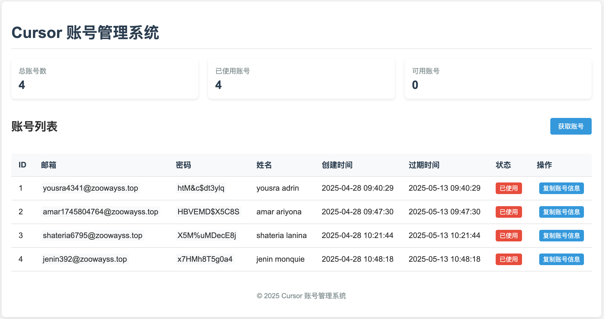
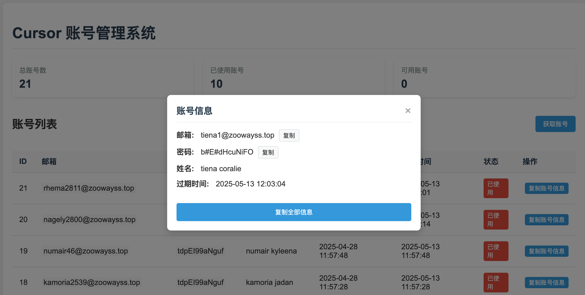
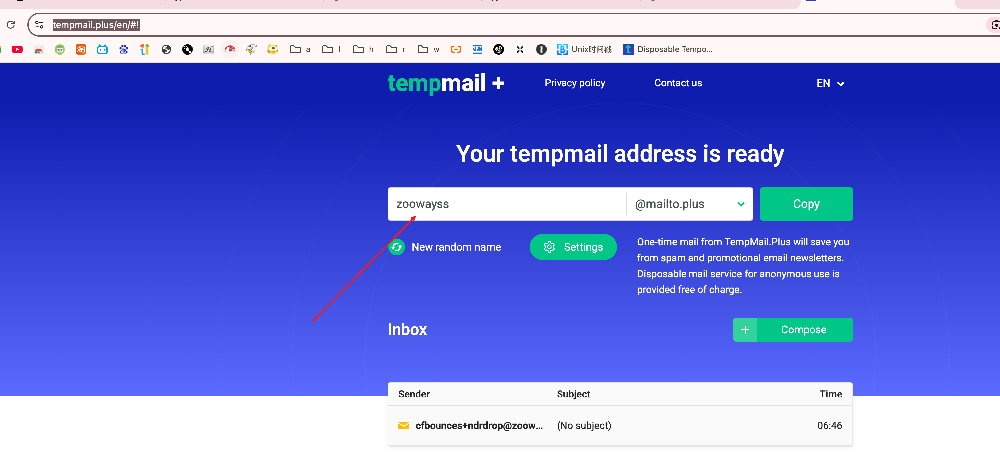

# Cursor 账号管理系统

本项目是站在巨人的肩膀上开发。 [源项目地址](https://github.com/chengazhen/cursor-auto-free) [参考项目](https://github.com/yeongpin/cursor-free-vip)

项目刚上线，还有很多bug 慢慢填吧

这是一个用于管理 Cursor 账号的 Web 服务，支持自动注册、存储账号信息、查看和修改账号状态。

[预览站点](https://cursor-account.zoowayss.dpdns.org)

资源有限，请勿滥用账号



## 如何使用

点击获取账号，这部分过程会很慢，请耐心等待，请勿多次点击获取账号，服务器资源有限请谅解。获取完会弹窗，复制即可

拿到账号密码，到自己的浏览器登录，[到这里](https://tempmail.plus/en/#!) 获取验证码




## 功能特点

- 自动注册 Cursor 账号并存储到 MySQL 数据库
- 提供 RESTful API 用于获取账号
- 提供 Web 页面用于查看和管理所有账号
- 支持点击复制账号信息
- 支持修改账号使用状态
- Docker 容器化部署

## 目前存在的问题

1. 同一个域名，账号注册过多会导致全部账号实效。这里后续会使用用户提供的域名，自己用自己的域名。

   没有域名怎么办  [看这里](https://linux.do/t/topic/26864)

   有了域名，还需要配置 cf 邮箱转发

## 快速开始

### 使用 Docker Compose 部署（推荐）

1. 克隆仓库
```bash
git clone https://github.com/zoowayss/cursor-auto-account.git
cd cursor-auto-account
```

2. 配置环境变量（可选）
创建 `.env` 文件并设置以下环境变量：
```
DB_HOST=your_db_host
DB_PORT=3306
DB_USER=your_db_user
DB_PASSWORD=your_db_password
DB_NAME=your_db_name
SECRET_KEY=your_secret_key
TOKEN_EXPIRY_DAYS=30
ADMIN_USERNAME=admin
ADMIN_PASSWORD=admin
EMAIL_DOMAIN=your_email_domain
```

3. 启动服务
```bash
docker-compose up -d
```

> 注意：如果不创建 `.env` 文件，将使用 docker-compose.yml 中的默认值

### 使用 Docker 直接部署

如果您不想使用 Docker Compose，也可以直接使用 Docker 命令部署：

1. 构建 Docker 镜像
```bash
docker build -t cursor-auto-account .
```

2. 运行 Docker 容器
```bash
docker run -d --name cursor-account \
  -p 8001:8001 \
  -p 9223:9223 \
  -e DB_HOST=your_db_host \
  -e DB_USER=your_db_user \
  -e DB_PASSWORD=your_db_password \
  -e DB_NAME=your_db_name \
  -e DB_PORT=3306 \
  cursor-auto-account
```

> 注意：请替换上述命令中的数据库连接信息为您自己的配置

### 关于 Chrome 调试端口

- 容器内的 Chrome 调试端口为 9222
- 通过 socat 将容器内的 9222 端口映射到 9223 端口，使其可以从外部访问
- 您可以通过访问 `http://localhost:9223` 来连接到 Chrome 调试界面

#### socat 端口转发说明

本项目使用 socat 工具实现端口转发，将容器内的 Chrome 调试端口 (9222) 映射到可从外部访问的端口 (9223)。这样做的好处是：

1. 解决了 Chrome 调试端口只监听 127.0.0.1 的限制
2. 使得宿主机和其他网络设备可以直接访问 Chrome 调试功能
3. 无需修改 Chrome 的启动参数或配置

socat 在容器启动时自动运行，无需额外配置。

### 本地开发部署

如果您想在本地开发环境中运行项目：

1. 安装依赖
```bash
pip install -r requirements.txt
# 或使用 uv 加速安装
uv pip install -r requirements.txt
```

2. 启动项目
```bash
python app.py
```

3. 访问服务
   - 网页界面: http://localhost:8001

## 免责声明

1. 本项目仅供学习和技术研究使用，不得用于商业目的
2. 使用本项目产生的任何法律责任由使用者自行承担
3. 本项目不保证所创建账号的长期可用性，Cursor官方政策变更可能导致功能失效
4. 请遵守Cursor的服务条款，合理使用生成的账号
5. 项目维护者不对使用本工具导致的任何问题负责
## Star History

[](https://www.star-history.com/#zoowayss/cursor-auto-account&Date)
## 许可证

MIT
